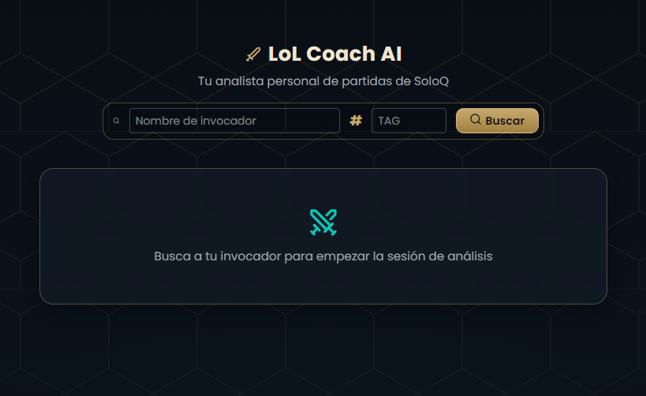
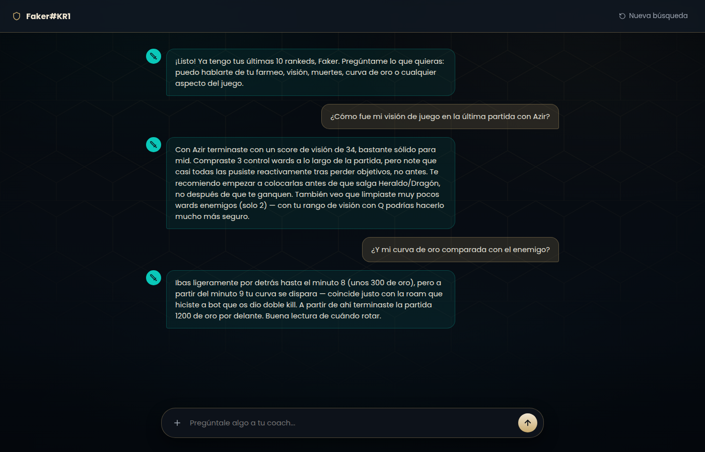
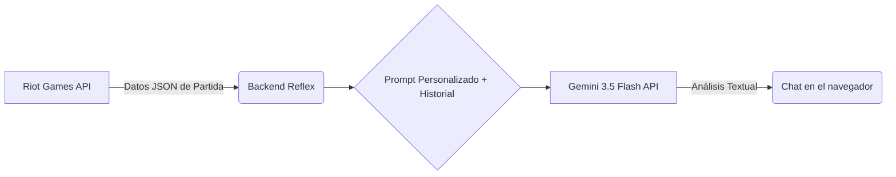

# LoL AI Coach: Análisis de Partidas

Este proyecto es un *coach* avanzado impulsado por Inteligencia Artificial diseñado para analizar partidas de League of Legends. Su objetivo principal es procesar datos complejos obtenidos de la API de Riot Games y utilizar el poder analítico de Google Gemini para generar informes detallados sobre el rendimiento del jugador, identificando fortalezas y áreas de mejora.

Este proyecto fue desarrollado como un ejercicio práctico avanzado para dominar la interacción con múltiples APIs externas (Riot Games y Google) y gestionar flujos complejos de datos JSON en Python.

Dado que el objetivo principal de este trabajo no es el desarrollo del frontend ni el diseño de la interfaz, se ha utilizado inteligencia artificial como apoyo para implementar el archivo `style.py` parte de la interfaz visual y animaciones.

<div align="center">
    
</div>

## Características Principales

*   **Análisis Profundo:** utiliza modelos avanzados de lenguaje (LLMs) para ir más allá de las estadísticas básicas, ofreciendo un análisis cualitativo del juego.
*   **Integración Multi-API:** conecta la rica fuente de datos de Riot Games con el procesamiento avanzado de Gemini.
*   **Reporte Automatizado:** genera automáticamente un informe estructurado que detalla qué se hizo bien y qué aspectos requieren mejora en las partidas analizadas.
*   **Chatbot con memoria:** no es una sola pregunta-respuesta suelta, el coach recuerda todo lo que se ha hablado en la sesión, así que puedes hacer preguntas de seguimiento ("y en la anterior?") sin perder contexto.

## Funcionamiento

El proceso de análisis sigue una secuencia lógica, desde la obtención de datos crudos hasta la generación del reporte final:

1.  **Búsqueda del invocador:** el usuario escribe su nombre y tag (estilo op.gg) en la pantalla inicial.
2.  **Ingesta de Datos:** se interactúa con la API de Riot Games para obtener el `puuid` del jugador y el detalle completo de sus últimas 10 partidas clasificatorias de SoloQ (con reintento automático si Riot responde con un límite de peticiones).
3.  **Estructuración JSON:** los datos recibidos se manejan y estructuran en formato JSON, que es el estándar de comunicación entre componentes del sistema.
4.  **Prompt Personalizado:** el *coach* utiliza un *prompt* personalizado diseñado específicamente para guiar a la IA sobre qué tipo de análisis debe realizarse con los datos proporcionados, indicándole exactamente qué jugador (por `puuid`) debe analizar dentro de cada partida.
5.  **Conversación con memoria:** cada pregunta que el usuario hace se añade al historial de la sesión; ese historial completo (no solo la última pregunta) se manda a Gemini en cada turno, para que el coach recuerde lo que ya se ha hablado.
6.  **Análisis por Gemini:** la combinación del JSON de las partidas, el *prompt* y el historial de la conversación se envía a la API de Google Gemini. El modelo `gemini-3.5-flash` procesa esta información para generar un análisis coherente y detallado.
7.  **Respuesta en el chat:** el texto de Gemini aparece como un nuevo mensaje del coach en la interfaz, sin necesidad de generar ni descargar ningún archivo.

## Tecnologías Utilizadas

*   **Lenguaje Principal:** Python
*   **Manejo de Solicitudes HTTP:** `requests` (para interactuar con APIs externas).
*   **Formato de Datos:** JSON (JavaScript Object Notation)
*   **API de Origen de Datos:** Riot Games API (League of Legends)
*   **Motor de Análisis IA:** Google Gemini API (`gemini-3.5-flash`)
*   **Reflex:** para crear el frontend y el chatbot para poder hablar con el coach desde el navegador.

## Instalación y puesta en marcha (paso a paso, desde cero, en Windows)

Sigue los pasos **en orden**, copiando y pegando los comandos tal cual.

### 1. Instalar Python

1.  Ve a **https://www.python.org/downloads/** y descarga la última versión de Python (el botón amarillo grande "Download Python 3.x.x").
2.  Abre el instalador descargado. **Muy importante:** en la primera pantalla, marca la casilla que dice **"Add python.exe to PATH"** (abajo del todo) antes de darle a "Install Now". Si no marcas esto, luego el ordenador no sabrá qué es el comando `python`.
3.  Deja que termine la instalación y dale a "Close".
4.  Comprueba que se instaló bien: abre el **menú Inicio**, escribe `PowerShell` y ábrelo. Escribe:
    ```
    python --version
    ```
    Debería salir algo como `Python 3.12.x`. Si en vez de eso te dice que no reconoce el comando, reinicia el ordenador (a veces hace falta para que el PATH se actualice) y vuelve a probar.

### 2. Descargar el proyecto

1.  Descarga el `.zip` del proyecto que te han pasado (o clónalo si usas Git) y descomprímelo en una carpeta fácil de encontrar, por ejemplo `C:\Users\TU_USUARIO\Desktop\lol_coach`.
2.  Dentro de esa carpeta deberías ver, entre otros, los archivos `rxconfig.py`, `requirements.txt`, `.env.example` y una subcarpeta `lol_coach` con `state.py`, `lol_coach.py` y `style.py`.

### 3. Abrir una terminal en la carpeta del proyecto

1.  Abre el **Explorador de archivos** y entra en la carpeta del proyecto (la que tiene `rxconfig.py`).
2.  Haz clic en la barra de direcciones de arriba (donde pone la ruta), borra lo que ponga, escribe `powershell` y pulsa Enter. Se abrirá una terminal ya situada en esa carpeta.

>[!IMPORTANT]
>A partir de aquí, todos los comandos se escriben en esa misma terminal.

### 4. Crear un entorno virtual

Un entorno virtual es una "caja aparte" donde se instalan las librerías de este proyecto sin mezclarse con nada más de tu ordenador. Créalo y actívalo:

```
python -m venv venv
venv\Scripts\activate
```

Si ha funcionado, verás que la línea de tu terminal ahora empieza por `(venv)`. **Cada vez que abras una terminal nueva para trabajar en este proyecto, tendrás que volver a ejecutar `venv\Scripts\activate`** (el `python -m venv venv` de creación solo hace falta una vez).

> Si PowerShell te da un error de "ejecución de scripts deshabilitada", ejecuta esto una vez y vuelve a intentarlo:
> ```
> Set-ExecutionPolicy -Scope CurrentUser RemoteSigned
> ```

### 5. Instalar las librerías necesarias

Con el entorno virtual activado (ves `(venv)` a la izquierda), instala todo lo que el proyecto necesita:

```
pip install -r requirements.txt
```

Esto tardará uno o dos minutos la primera vez.

### 6. Conseguir tus propias API keys

Este proyecto necesita dos claves, **personales e intransferibles**, que tienes que sacar tú:

*   **Riot Games:** entra en **https://developer.riotgames.com/**, inicia sesión con tu cuenta de Riot y copia la **"Development API Key"** que aparece en tu panel (caduca cada 24h, así que si un día deja de funcionar, entra y genera una nueva).
*   **Google Gemini:** entra en **https://aistudio.google.com/apikey**, inicia sesión con una cuenta de Google y crea una API key nueva.

Guarda las dos claves en algún sitio a mano, las necesitas en el siguiente paso.

### 7. Configurar el archivo `.env`

1.  En la carpeta del proyecto crea un archivo `.env` (así, con el punto delante y sin nada más).
2.  Abre el archivo `.env` con el Bloc de notas (clic derecho → Abrir con → Bloc de notas) y sustituye los valores de ejemplo por tus claves reales, sin comillas:
    ```
    RIOT_API_KEY=tu_clave_de_riot_aqui
    GOOGLE_API_KEY=tu_clave_de_google_aqui
    ```
3.  Guarda el archivo y ciérralo.

### 8. Inicializar Reflex

La primera vez que se usa Reflex en una carpeta, hay que inicializarlo (descarga algunos componentes internos):

```
reflex init
```

Si te pregunta por una plantilla, elige la opción **"blank"** (en blanco), no queremos ninguna plantilla de ejemplo, ya tenemos nuestro propio código.

### 9. Ejecuta el script `run.bat`

```bash
.\run.bat
```

### Problemas típicos

*   **"python no se reconoce como un comando":** no marcaste "Add python.exe to PATH" al instalar. Reinstala Python y marca esa casilla.
*   **Error 401 al buscar un invocador:** revisa que el archivo se llame exactamente `.env` (no `.env.txt`) y que esté en la carpeta raíz del proyecto, junto a `rxconfig.py`. Si tu clave de Riot es de las de 24h, puede que haya caducado: genera una nueva.
*   **Error 429 / muy pocas partidas encontradas:** es el límite de peticiones de la API de Riot; el propio código ya reintenta automáticamente, pero si tu cuenta tiene muy pocas partidas de SoloQ recientes, puede que no llegue a 10.
*   **`reflex: command not found`:** seguramente el entorno virtual no está activado; ejecuta `venv\Scripts\activate` de nuevo.

## Chatbot

La interfaz está pensada como un chat de pantalla complet. En cuanto encuentra al invocador, la pantalla de búsqueda da paso automáticamente al chat, con las burbujas de conversación estilo ChatGPT: tus mensajes a la derecha, las respuestas del coach a la izquierda.

<div align="center">
    
</div>

Desde el chat puedes preguntar por cualquier aspecto de tus últimas partidas: visión, farmeo, curva de oro, muertes, macro, decisiones concretas,  y el coach responde apoyándose únicamente en tus estadísticas dentro del JSON, ignorando a los otros 9 jugadores salvo como contexto.

>[!NOTE]
>La captura de arriba usa una conversación de ejemplo (con datos ficticios) para ilustrar el diseño de la interfaz.

## Arquitectura y Pipeline de Datos

La arquitectura es lineal, basada en el flujo de datos entre servicios externos:



### Detalle del Proceso Técnico

El corazón del sistema es la comunicación entre los dos servicios de IA/Datos:

1.  **Obtención de Datos:** se utiliza `requests` para consultar el *endpoint* de Riot Games, recibiendo un gran volumen de datos en formato JSON.
2.  **Construcción del Payload:** el backend toma este JSON y lo combina con la instrucción detallada (el *prompt*) que define el rol del coach, más el historial de mensajes ya intercambiados en la sesión.
3.  **Llamada a Gemini:** se realiza una llamada a la API de Google, enviando el contenido combinado para su análisis:

```python
# Pseudocódigo
response = cliente.models.generate_content(
    model="gemini-3.5-flash",
    contents=historial_de_la_conversacion,
    config=types.GenerateContentConfig(system_instruction=prompt_coach),
)
respuesta_coach = response.text
```

## Notas Técnicas y Decisiones de Diseño

*   **Modelo Seleccionado:** se optó por `gemini-3.5-flash` debido a su excelente equilibrio entre capacidad analítica avanzada (necesaria para el análisis de juego) y eficiencia, lo cual es crucial al manejar grandes volúmenes de datos JSON. También se valoró una versión local con Ollama, pero se descartó porque no era viable para todos los usuarios y presentaba tiempos de respuesta mayores.
*   **Manejo del Prompt:** la clave del sistema reside en la ingeniería del *prompt*. Este no solo pide un resumen; define las categorías de análisis que debe seguir Gemini (qué hacer bien, qué mejorar, etc.), asegurando una salida estructurada y útil para el usuario final.
*   **Flujo síncrono y sencillo:** el backend usa `requests` normal (sin `async`/`await`), porque el pipeline es de una única línea secuencial por usuario, no hay necesidad real de concurrencia aquí, y mantenerlo síncrono hace el código mucho más fácil de leer y depurar.
*   **Claves como variables de entorno:** ni la API key de Riot ni la de Google están escritas en el código; se cargan desde un archivo `.env` (no incluido en el repositorio) con `python-dotenv`.

## Posibles Mejoras

*   **Persistencia:** implementar una base de datos para almacenar los resultados históricos del coach, permitiendo un seguimiento longitudinal del progreso del jugador.
*   **Estadísticas visuales:** curva de oro y mapa de calor de muertes por partida.
*   **Entrada por voz:** dictar la pregunta al coach en vez de escribirla.
>[!CAUTION]
> La función de análisis de OTPs sigue en fase beta. Si no has jugado recientemente con alguno de ellos podría fallar, ya que el sistema se basa en los objetos que te han dado una mayor tasa de victoria.